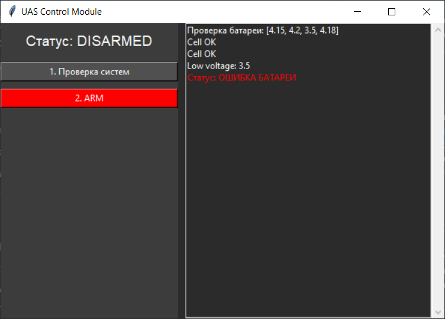
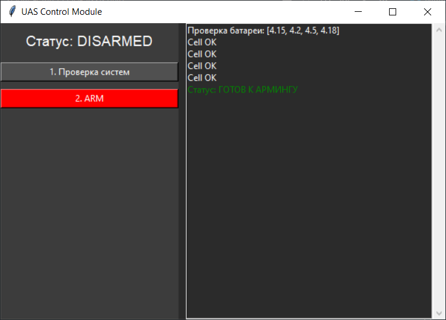

# Самостоятельная работа «Разработка программного кода»

Перед вами задание для самостоятельной работы по теме «Разработка программного кода». Данное задание предназначено для отработки полученных навыков и закрепления материала. Ваша работа не будет проверяться преподавателем, но вы можете сами оценить себя сами по приведённому ниже чек-листу.

**Тема задания:** Создание событийно-ориентированного интерфейса управления дроном с реализацией предполётной проверки и конечного автомата состояний.

## Описание задания

Ниже приведён «скелет» программы управления дроном. Код разбит на функциональные блоки, но содержит логические ошибки, нарушения компоновки интерфейса и отсутствующие связи между кнопками и функциями.

**Цель работы:** Исправить предоставленные фрагменты кода и собрать их в единое приложение, которое выполняет следующие функции:

1. Отображение статуса: Интерфейс корректно показывает текущее состояние (DISARMED/ARMED/FLYING).
2. Предполётная проверка: Реализован алгоритм проверки сенсоров перед армингом.
3. Управление: Реализована защита (нельзя взлететь, не заармив дрон) и смена полётных режимов.

## Этап 1: Компоновка интерфейса (GUI)

### Техническое задание

Необходимо исправить верстку главного окна.

**Требование:** Окно должно быть разделено на две визуальные зоны:
- Слева — Панель управления (кнопки)
- Справа — Лог событий (Listbox)

**Проблема в исходнике:** Все элементы «слиплись» или расположены хаотично из-за неверного использования параметров pack(). Кнопка проверки системы перекрывает поле статуса.

### Задачи

1. Перепишите pack() для фреймов так, чтобы control_frame был слева (занимал 40% ширины), а log_frame справа (60%).
2. Выстройте кнопки строго вертикально в левом фрейме с отступами (pady).
3. Добавьте в log_frame виджет Listbox и привяжите к нему Scrollbar (используйте пример с ).

## Этап 2: Логика предполётной проверки

### Техническое задание

Перед армингом (ARM) дрон должен проверить напряжения на ячейках батареи.

**Входные данные:** Список значений напряжения cells = [4.1, 4.2, 3.8, 4.1]

**Условие:** Если хотя бы одна ячейка показывает напряжение ниже 4.0, система выдает ошибку в статус и блокирует дальнейшие действия. Если всё ок — пишет "System Ready".

**Проблема в исходнике:** Цикл проверки написан неверно. Он проверяет только последнее значение или не прерывается при ошибке.

### Задачи

1. Исправьте цикл for. Используйте оператор break при обнаружении низкой напруги, чтобы флаг system_ok гарантированно оставался False.
2. Вместо print() реализуйте вывод сообщений в Listbox (лог), который вы создали на Этапе 1.
3. Привяжите эту функцию к кнопке «1. Проверка систем».

## Примеры работы программы

