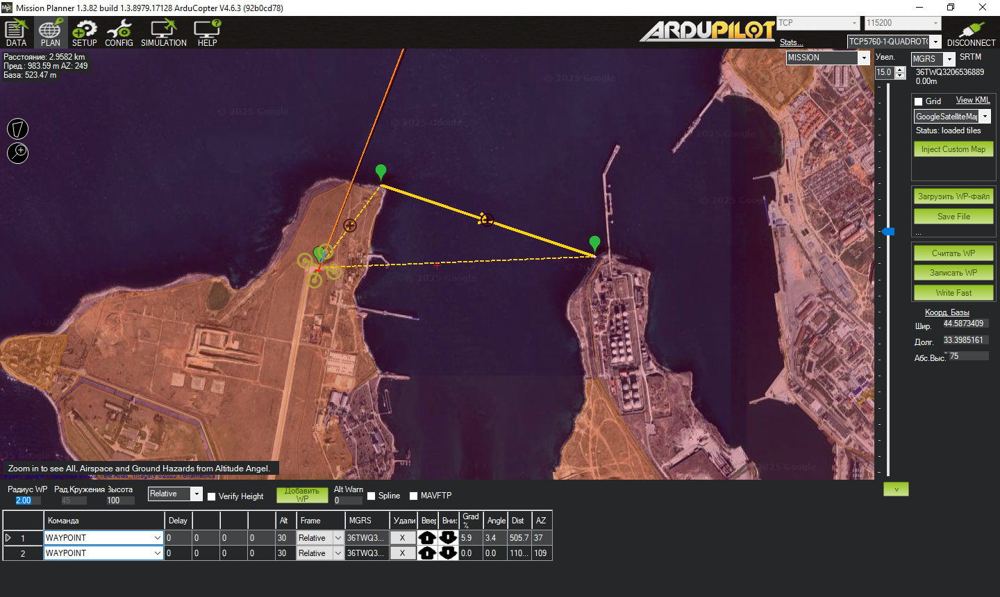

# Система автоматического патрулирования периметра с использованием БПЛА

## ВАЖНАЯ ИНФОРМАЦИЯ!!! 
Данная программа лишь вирутальная эмуляция гипотетической ситуации для сдачи экзамена. Никакого отношения с реальным БПЛА и заказчиком не имеет.

## Описание проекта

Система предназначена для автоматического патрулирования периметра охраняемой зоны с использованием беспилотного летательного аппарата (БПЛА). Программное обеспечение позволяет управлять маршрутом патрулирования, выполнять автоматический взлет, облет ключевых точек наблюдения и возвращение на базу.

## Основные компоненты

1. `drone_monitor.py` - Модуль мониторинга состояния дрона
2. `flight_control.py` - Модуль управления полетом
3. `perimeter security.py` - Основной скрипт патрулирования периметра
4. `return_base.py` - Модуль возврата на базу

## Требования

- Python 3.7 или выше
- SITL (Software In The Loop) симулятор ArduPilot
- Подключение к MAVLink (по умолчанию TCP 127.0.0.1:14550)

## Установка

1. Установите зависимости:
   ```bash
   pip install -r requirements.txt
   ```

2. Запустите SITL симулятор ArduPilot

3. Убедитесь, что симулятор доступен по адресу 127.0.0.1:14550

## Настройка Mission Planner

1. Откройте Mission Planner
2. Нажмите Ctrl + F для входа в настройки
3. Выберите TCP 14550 в пункте MAVLink
4. Поставьте галочку в чек-боксе "Write access"
5. Выберите вкладку Simulation и выберите тип БПЛА Multirotor

## Запуск

1. Запустите Python файл perimeter_security.py:
   ```bash
   python "perimeter security.py"
   ```

2. Во вкладке Plane нажмите "Считать WP" (Read WP)

3. Во вкладке Data в меню команд:
   - Выберите "ARM" для включения двигателей
   - На карте правой кнопкой мыши выберите команду "Take Off" (взлет) на указанную высоту
   - В меню действий выберите "AUTO" для начала выполнения полетного задания

Для тестирования возврата на базу:

```bash
python return_base.py
```

## Маршрут патрулирования

Маршрут состоит из следующих точек:
1. Базовая станция (текущая позиция дрона)
2. Береговая наблюдательная точка (400м север, 300м восток от базы)
3. Контрольная точка патрулирования (50м север, 1350м восток от базы)

Высота полета: 30 метров

## Скриншоты


*Общий вид маршрута патрулирования периметра*


*Вид с третьей контрольной точки*


*Процесс возврата на базу*